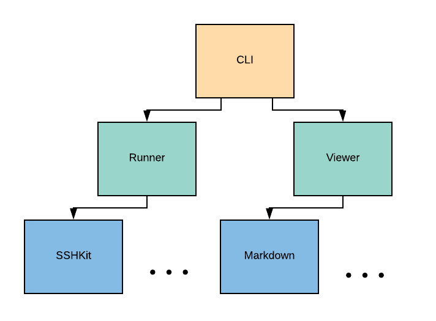
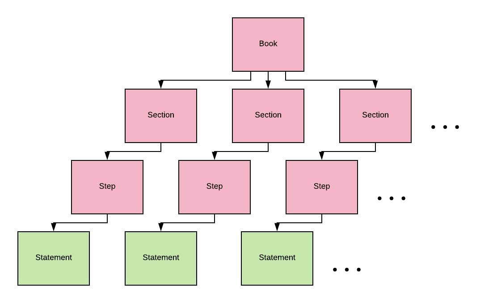

# Runbook

[](https://badge.fury.io/rb/runbook)
[](https://travis-ci.org/braintree/runbook)
[](https://gitter.im/braintree/runbook?utm_source=badge&utm_medium=badge&utm_campaign=pr-badge)

_See our [blog post](https://medium.com/braintree-product-technology/https-medium-com-braintree-product-technology-runbook-be6f072cfc0d) for the philosophy behind Runbook and an overview of its features._

Runbook provides a DSL for specifying a series of steps to execute an operation. Once your runbook is specified, you can use it to generate a formatted representation of the book or to execute the runbook interactively. For example, you can export your runbook to markdown or use the same runbook to execute commands on remote servers.

<div align="center">
  
</div>
<br>

Runbook has two modes for evaluating your runbook. The first mode, view mode, allows you to export your runbook into various formats such as markdown. The second mode, run mode, allows you to execute behavior based on the statements in your runbook.

<div align="center">
  
</div>
<br>

Runbook can be integrated into existing infrastructure in many different ways. It can be integrated into existing projects to add orchestration functionality, installed on systems as a stand-alone executable, or runbooks can be defined as self-executable scripts. In addition to being useful for automating common tasks, runbooks are a perfect bridge for providing operations teams with step-by-step instructions to handle common issues (especially when solutions cannot be easily automated).

Lastly, Runbook provides an extendable interface for augmenting the DSL and defining your own behavior.

## Features

* **Remote Command Execution** - Runbook lets you execute commands on remote hosts using [SSHKit](https://github.com/capistrano/sshkit)
* **Dynamic Control Flow** - Runbooks can start execution at any step and can skip steps based on user input.
* **Resumable** - Runbooks save their state at each step. If your runbook encounters an error, you can resume your runbook at the previous step after addressing the error.
* **Noop and Auto Modes** - Runbooks can be executed in noop mode. This allows you to see what a runbook will do before it executes. Runbooks can be run in auto mode to eliminate the need for human interaction.
* **Execution Lifecycle Hooks** - Runbook provides before, after, and around hooks to augment its execution behavior.
* **Tmux Integration** - Runbook integrates with [tmux](https://github.com/tmux/tmux). You can define terminal pane layouts and send commands to terminal panes.
* **Generators** - Runbook provides commands to generate runbooks, extensions, and runbook projects. You can define your own generators for easy, customized runbook creation.
* **Extendable DSL** - Runbook's DSL is designed to be extendable. You can extend its DSL to add your own behavior.

## Use Cases

Though Runbook can solve a myriad of problems, it is best used for removing the need for repeated, rote developer operations. Runbook allows developers to execute processes at a higher level than that of individual command-line commands. Additionally, Runbook provides features to simply and safely execute operations in mission-critical environments.

Runbook is not intended to replace more special-purpose automation solutions such as configuration management solutions (Puppet, Chef, Ansible, Salt), deployment solutions (Capistrano, Kubernetes, Docker Swarm), monitoring solutions (Nagios, Datadog), or local command execution (shell scripts, Rake tasks, Make). Instead Runbook is best used as a glue when needing to accomplish a task that cuts across these domains.

## Quick Start

### Installation

Add this line to your application's Gemfile:

```ruby
gem 'runbook'
```

And then execute:

    $ bundle

Or install it yourself as:

    $ gem install runbook

### Your First Runbook

Generate a runbook using the Runbook Generator:

    $ runbook generate runbook my_first_runbook

Execute the runbook:

    $ runbook exec my_first_runbook.rb

## Slightly Longer Start

When setting up Runbook, you can install it at a system level, create a dedicated runbook project, or incorporate Runbook into an existing project.

### System Level Setup

Install runbook at a system level using `gem`:

    $ gem install runbook

Set any Runbook [configuration](#configuration) in `/etc/runbook.conf`.

Generate runbook files using `runbook generate runbook`. Execute `runbook generate help runbook` for more details.

Installing Runbook at a system level can be useful for executing runbooks on remote hosts or within docker containers. One disadvantage of installing Runbook at a system level is that there is no built-in solution for dependency management.

### New Project Setup

Install runbook using `gem`:

    $ gem install runbook

Generate a new runbook project:

    $ runbook generate project <PROJECT_NAME>

This will generate a new runbook project. Cd into your project directory and initialize its dependencies:

    $ cd <PROJECT_NAME> && bin/setup

### Existing Project Setup

Add this line to your project's Gemfile:

```ruby
gem 'runbook'
```

Install the Runbook gem:

    $ bundle install

Initialize Runbook in your project:

    $ bundle exec runbook init

## Contents

* [1. Runbook Anatomy](#runbook-anatomy)
  * [1.1 Entities, Statements, and Setters](#entities-statements-and-setters)
    * [1.1.1 Books, Sections, Steps, and Setup](#books-sections-steps-and-setup)
      * [1.1.1.1 Books](#books)
      * [1.1.1.2 Sections](#sections)
      * [1.1.1.3 Steps](#steps)
      * [1.1.1.4 Setup](#setup)
      * [1.1.1.5 Tags and Labels](#tags-and-labels)
    * [1.1.2 Statements](#statements)
      * [1.1.2.1 Ask](#ask)
      * [1.1.2.2 Assert](#assert)
      * [1.1.2.3 Capture](#capture)
      * [1.1.2.4 Capture All](#capture-all)
      * [1.1.2.5 Command](#command)
      * [1.1.2.6 Confirm](#confirm)
      * [1.1.2.7 Description](#description)
      * [1.1.2.8 Download](#download)
      * [1.1.2.9 Layout](#layout)
      * [1.1.2.10 Note](#note)
      * [1.1.2.11 Notice](#notice)
      * [1.1.2.12 Ruby Command](#ruby-command)
      * [1.1.2.13 Tmux Command](#tmux-command)
      * [1.1.2.14 Upload](#upload)
      * [1.1.2.15 Wait](#wait)
      * [1.1.2.16 Tmux Layouts](#tmux-layouts)
    * [1.1.3 Setters](#setters)
* [2. Working With Runbooks](#working-with-runbooks)
  * [2.1 Via The Command Line](#via-the-command-line)
  * [2.2 From Within Your Project](#from-within-your-project)
  * [2.3 Self-executable](#self-executable)
* [3. Configuration](#configuration)
  * [3.1 Configuration Files](#configuration-files)
* [4. Best Practices](#best-practices)
  * [4.1 Iterative Automation](#iterative-automation)
  * [4.2 Parameterizing Runbooks](#parameterizing-runbooks)
  * [4.3 Passing State](#passing-state)
  * [4.4 Execution Best Practices](#execution-best-practices)
  * [4.5 Remote Command Execution](#remote-command-execution)
  * [4.6 Composing Runbooks](#composing-runbooks)
  * [4.7 Deep Nesting](#deep-nesting)
  * [4.8 Load Vs. Eval](#load-vs-eval)
* [5. Generators](#generators)
  * [5.1 Predefined Generators](#predefined-generators)
  * [5.2 Custom Generators](#custom-generators)
* [6. Extending Runbook](#extending-runbook)
  * [6.1 Adding New Statements](#adding-new-statements)
  * [6.2 Adding Run and View Functionality](#adding-run-and-view-functionality)
  * [6.3 DSL Extensions](#dsl-extensions)
  * [6.4 Adding Runs and Views](#adding-runs-and-views)
  * [6.5 Augmenting Functionality With Hooks](#augmenting-functionality-with-hooks)
  * [6.6 Adding New Run Behaviors](#adding-new-run-behaviors)
  * [6.7 Adding to Runbook's Run Metadata](#adding-to-runbooks-run-metadata)
  * [6.8 Adding to Runbook's Configuration](#adding-to-runbooks-configuration)
* [7. Testing](#testing)
* [8. Known Issues](#known-issues)
* [9. FAQ](#faq)
* [10. Development](#development)
* [11. Contributing](#contributing)
* [12. Feature Requests](#feature-requests)
* [13. License](#license)
* [14. Code of Conduct](#code-of-conduct)

## Runbook Anatomy

Below is an example of a runbook:

```ruby
Runbook.book "Restart Nginx" do
  description <<-DESC
This is a simple runbook to restart nginx and verify
it starts successfully
  DESC

  section "Restart Nginx" do
    server "app01.prod"
    user "root"

    step "Stop Nginx" do
      note "Stopping Nginx..."
      command "service nginx stop"
      assert %q{service nginx status | grep "not running"}
    end

    step { wait 5 }

    step "Start Nginx" do
      note "Starting Nginx..."
      command "service nginx start"
      assert %q{service nginx status | grep "is running"}
      confirm "Nginx is taking traffic"
      notice "Make sure to report why you restarted nginx"
    end
  end
end
```

Hierarchically, a runbook looks like this:

<div align="center">
  
</div>
<br>

### Entities, Statements, and Setters

A runbook is composed of entities, statements, and setters. Runbook entities contain either other entities or statements. Examples of entities include Books, Sections, and Steps. They define the structure of the runbook and can be considered the "nodes" of the tree structure. As entities are the nodes of the tree structure, statements are the "leaves" of the structure and comprise the various behaviors or commands of the runbook. Setters, typically referenced from within steps, associate state with the node, which can be accessed by its children.

#### Books, Sections, Steps, and Setup

Entities are composed of a title and a list of items which are their children. Each entity can be rendered with a specific view or executed with a specific run.

##### Books

Books are the root of a runbook. They are initialized as follows:

```ruby
Runbook.book "Unbalance node" do
end
```

Every book requires a title. Books can have description, layout, section, and step children. Descriptions describe the book and are declared with the `description` keyword.

##### Sections

A book is broken up into sections. Every section requires a title. Sections can have descriptions, other sections, or steps as children.

##### Steps

Steps hold state and group together a set of statements. Steps do not require titles or children. This allows runbooks to be very flexible. You can fill out steps as needed, or be terse when the behavior of the step is self-evident. Steps without titles will not prompt to continue when running in paranoid mode.

##### Setup

Setup is a special entity that is always executed. It is not skipped when starting or resuming execution in the middle of a runbook. A prompt is never presented to determine if you should or should not execute the setup section. The setup section is similar to the step entity in that it shares the same DSL. In other words, any keywords available within steps are also available within the setup section.

The setup section provides two important use cases. First, it allows you ensure any dependent values are defined when executing your runbook. If skipping the initial steps of your runbook and starting in the middle, you can be sure that any initialization steps have been executed. For example, presume you have a runbook that prompts for a list of servers, stops the servers, and then starts them. It would be advantageous to define the prompting server logic in a setup section, so you can start the runbook at the start server step and know that the list of servers is defined.

Second, if you dynamically define the sections and steps in your runbook based on user input, then doing this in the setup section allows you start the runbook in the middle of the dynamically defined steps.

Because the setup section is always executed, it's execution should be idempotent. In other words, the setup section should be able to be executed multiple times in a row and produce the same result.

It may be ideal to ensure user input is only asked for once when executing a setup section.

```ruby
Runbook.book "Make Pizza" do
  setup do
    ruby_command do
      @toppings ||= ENV["TOPPINGS"]
      ask "What toppings would you like?", into: :toppings, default: "cheese" unless @toppings
    end
  end
end
```

The above example will set `@toppings` from a passed-in environment variable if present, otherwise it will ask the user to set `@toppings`. If toppings have already has been defined from a previous execution, it will not prompt the user for the value again. Because this logic references a value that is defined at runtime (`@toppings`), it must be wrapped in a `ruby_command`.

##### Tags and Labels

Any entity can be associated with arbitrary tags or labels. Once tags or labels are assigned, entity behavior can be modified using [hooks](#augmenting-functionality-with-hooks).

```ruby
Runbook.book "Bounce Nodes", :untested do
  step "Disable monitoring", :skip do
    confirm "Have you disabled health monitoring?"
  end

  step "Restart nodes", :aws_only, :mutator, labels: {rails_env: :production} do
    confirm "Have you restarted the nodes?"
  end
end
```

```ruby
Runbook::Runs::SSHKit.register_hook(:warn_for_untested_runbook, :before, Runbook::Entities::Book) do |object, metadata|
  warning = "This runbook has not yet been tested. Beware of bugs!"
  metadata[:toolbox].warn(warning) if object.tags.include?(:untested)
end

Runbook::Runs::SSHKit.register_hook(:skip_skippable_entities, :around, Runbook::Entity) do |object, metadata, block|
  next if object.tags.include?(:skip)
  next if object.labels[:rails_env] && object.labels[:rails_env] != ENV["RAILS_ENV"]
  block.call
end
```

#### Statements

Statements are the workhorses of runbooks. They comprise all the behavior runbooks execute. Runbook comes with the following statements:

##### Ask

Prompts the user for a string and stores its value on the containing step entity. Once this statement is executed, its value is accessed as an instance variable under the `into` parameter. This value can be referenced in later statements such as the `ruby_command` statement. An optional `default` value can be specified. An optional `echo` parameter can be specified to indicate whether typed input should be echoed to the screen.

```ruby
ask "What percentage of requests are failing?", into: :failing_request_percentage, default: "100", echo: true

ruby_command do
  note "Failing request percentage: #{@failing_request_percentage}"
end
```

In the above example, the `note` statement must be wrapped in a `ruby_command` statement. Without wrapping `note` in a `ruby_command`, it would be evaluated at compile time but the user will only be asked for input when the runbook is executed (so `@failing_request_percentage` would not have a value). If you find yourself wrapping many or all runbook statements in ruby commands it may make sense to set these values at compile time using environment variables.

##### Assert

Runs the provided `cmd` repeatedly until it returns true. A timeout and maximum number of attempts can be set. You can specify a command to be run if a timeout occurs or the maximum number of attempts is hit. Commands can optionally be specified as `raw`. This tells SSHKit to not perform auto-wrapping of the commands, but execute the exact string on the remote server. See SSHKit's documentation for more details.

```ruby
assert(
  'service nginx status | grep "is running"',
  cmd_ssh_config: {servers: ["host1.prod"], parallelization: {strategy: :parallel}},
  cmd_raw: false,
  interval: 3, # seconds
  timeout: 300, # seconds
  attempts: 3,
  abort_statement: Runbook::Statements::Command.new(
    "echo 'help' | mail -s 'need help' page-me@page-me.com",
    ssh_config: {servers: [:local], parallelization: {strategy: :parallel}},
    raw: false
  )
)
```

##### Capture

Runs the provided `cmd` and captures its output into `into`. Once captured, this value can be referenced in later statements such as the `ruby_command` statement. An optional `ssh_config` can be specified to configure how the capture command gets run. Capture commands take an optional `strip` parameter that indicates if the returned output should have leading and trailing whitespace removed. Capture commands also take an optional `raw` parameter that tells SSHKit whether the command should be executed as is, or to include the auto-wrapping of the ssh_config.

```ruby
capture %Q{wc -l file.txt | cut -d " " -f 1}, into: :num_lines, strip: true, ssh_config: {user: "root"}
```

##### Capture All

Accepts the same parameters as `capture`, but returns a hash of server names to capture results. `capture_all` should be used whenever multiple servers are specified because the returned result of `capture` is non-deterministic when specifying multiple servers.

```ruby
capture_all %Q{wc -l file.txt | cut -d " " -f 1}, into: :num_lines, strip: true, ssh_config: {servers: ["host1.stg", "host2.stg"]}
```

##### Command

Runs the provided `cmd`. An optional `ssh_config` can be specified to configure how the command gets run. Commands also take an optional `raw` parameter that tells SSHKit whether the command should be executed as is, or to include the auto-wrapping of the ssh_config.

```ruby
command "service nginx start", ssh_config: {servers: ["host1.prod", "host2.prod"], parallelization: {strategy: :groups}}
```

##### Confirm

Proposes the prompt to the user and exits if the user does not confirm the prompt.

```ruby
confirm "Asset requests have started trickling to the box"
```

##### Description

Prints the description in an unformatted manner to the user

```ruby
description <<-DESC
This message will print directly to the user as written, without
additional formatting.
DESC
```

##### Download

Downloads the specified file to `to`. An optional `ssh_config` can be specified to configure how the download command gets run, for example specifying the remote host and remote directory to download from. Optional `options` can be specified that get passed down to the underlying sshkit implementation

```ruby
download '/home/pblesi/rad_file.txt', to: my_rad_file.txt, ssh_config: {servers: ["host1.prod"]}, options: {log_percent: 10}
```

##### Layout

Defines a tmux layout to be used by your runbook. When executing the runbook, the specified layout will be initialized. This statement can only be specified at the book level. See [Tmux Layouts](#tmux-layouts) for more details.

```ruby
layout [[
  [:runbook, :deploy],
  [:monitor_1, :monitor_2, :monitor_3],
]]
```

##### Note

Prints a short note to the user.

```ruby
note "This operation kills all zombie processes"
```

##### Notice

Prints out an important message to the user.

```ruby
notice "There be dragons!"
```

##### Ruby Command

Executes its block in the context of the parent step. The block is passed the ruby_command statement, the execution metadata, and the run as arguments.

```ruby
ruby_command do |rb_cmd, metadata, run|
  if (failure_rate = rb_cmd.parent.failing_request_percentage) > 25
    `echo 'Help! failure rate at #{failure_rate}' | mail -s 'High failure rate!' page-me@page-me.com`
  else
    `echo "Experienced failure rate of #{failure_rate}" | mail -s 'Help me eventually' not-urgent@my_site.com`
  end
  notice "Email sent!"
end
```

Metadata at execution time is structured as follows:

```ruby
{
  book_title: "Restart Nginx", # The title of the current runbook
  depth: 1, # The depth within the tree (book starts at depth 1)
  index: 0, # The index of the item in terms of it's parent's children (starts at 0 for first child)
  position: "1.1", # A string representing your current position within the tree
  noop: false, # A boolean indicating if you are running in noop mode. ruby_command blocks are never evaluated in noop mode
  auto: false, # A boolean indicating if you are running in auto mode
  paranoid: true, # A boolean indicating if you are running in paranoid mode (prompting before each step)
  start_at: 0, # A string representing the step where nodes should start being processed
  toolbox: Runbook::Toolbox.new, # A collection of methods to invoke side-effects such as printing and collecting input
  layout_panes: {}, # A map of pane names to pane ids. `layout_panes` is used by the `tmux_command` to identify which tmux pane to send the command to
  repo: {}, # A repository for storing data and retrieving it between ruby_commands. Any data stored in the repo is persisted if a runbook is stopped and later resumed.
}
```

Additional methods that the `ruby_command` block has access to are:

 * `metadata[:toolbox].prompt`: A `TTY::Prompt` for retrieving input from the user
 * `metadata[:toolbox].ask(msg)`: retrieve user input
 * `metadata[:toolbox].yes?(msg)`: provide the user with a yes/no prompt
 * `metadata[:toolbox].output(msg)`: output text to the user
 * `metadata[:toolbox].warn(msg)`: output warning text to the user
 * `metadata[:toolbox].error(msg)`: output error text to the user
 * `metadata[:toolbox].exit(return_value)`: exit the process with the specified response code

##### Tmux Command

Runs the provided `cmd` in the specified `pane`.

```ruby
tmux_command "tail -Fn 100 /var/log/nginx.log", :monitor_1
```

##### Upload

Uploads the specified file to `to`. An optional `ssh_config` can be specified to configure how the upload command gets run, for example specifying the remote host and remote directory to upload to. Optional `options` can be specified that get passed down to the underlying sshkit implementation

```ruby
upload my_secrets.yml, to: secrets.yml, ssh_config: {servers: ["host1.prod"]}, options: {log_percent: 10}
```

##### Wait

Sleeps for the specified amount of time (in seconds)

```ruby
wait 5
```

##### Tmux Layouts

Runbook provides native support for defining tmux layouts and executing commands in separate tmux panes. Layouts are specified by passing an array or hash to the `layout` statement in book blocks.

```ruby
Runbook.book "My Book" do
  layout [
    :left,
    {name: :middle, directory: "/var/log", command: "tail -Fn 100 auth.log"},
    [:top_right, {name: :bottom_right, runbook_pane: true}]
  ]
end
```

When layout is passed as an array, each element of the array represents a pane stacked side-by-side with the other elements. Elements of the array can be symbols, hashes, or arrays.

Symbols and hashes represent panes. Hash keys for a pane include `name`, `directory`, `command`, and `runbook_pane`. `name` is the identifier used for the pane. This is used when specifying what pane you want to execute tmux commands in. `directory` indicates the starting directory of the pane. `command` is the initial command to execute in the pane when it is created. `runbook_pane` indicates which pane in the layout should hold the executing runbook. Only one pane should be designated as the `runbook_pane` and the runbook pane should not have a directory or command specified.

Arrays nested underneath the initial array split the pane from top to bottom. Arrays nested under these arrays split the pane from side to side, ad infinitum. You can start spliting panes from top to bottom as opposed to side-by-side by immediately nesting an array.

```ruby
Runbook.book "Stacked Layout" do
  layout [[
    :top,
    :middle,
    :bottom,
  ]]
end
```

When a hash is passed to `layout`, the keys of the hash represent window names and the values represent pane layouts.

```ruby
Runbook.book "Multi Window Layout" do
  layout({
    :web_monitor => [
      :left, :middle, :right,
    ],
    :db_monitor => [[
      :top, :middle, :bottom,
    ]]
  })
end
```

Notice in the example that parenthesis are used to wrap the hash. Ruby will raise a syntax error if `layout`'s argument is not wrapped in parenthesis when passing a hash. Runbook expects that it is running in the last window in a tmux session. If you are running a runbook that uses a multi-window layout, the layout will not work unless runbook is running in the last window in the session.

If you want panes to be un-evenly spaced, you can replace the array of panes with a hash where the keys are panes and the values are numbers. The panes will be spaced according to the specified numbers.

```ruby
Runbook.book "Uneven Layout" do
  layout [[
    {:left => 20, {name: :middle, runbook_pane: true} => 60, :right => 20},
    {:bottom_left => 5, :bottom_right => 5},
  ]]
end
```

Tmux layouts are persisted between runs of the same runbook. As long as none of the panes initially created by the runbook are closed, running the same runbook in the same pane will not recreate the tmux layout, but will reuse the existing layout. This is helpful when a runbook does not complete and must be restarted. When a runbook finishes, it asks if you want to close all opened panes. If your runbook is running in auto mode it will automatically close all panes when finished.

#### Setters

Setters set state on the parent item, typically the containing step. Runbook comes with the following setters:

**parallelization**: Specifies the SSHKit parallelization parameters for all commands in the entity. The default parallelization strategy is `:parallel`. Other strategies include `:sequence` and `:groups`. See [SSHKit](https://github.com/capistrano/sshkit#parallel) for more details on these options.

```ruby
parallelization strategy: :parallel, limit: 2, wait: 2
```

**server**: Specifies the server to use for all commands in the entity. This command in conjunction with `servers` are declarative and overwrite each other. So if you specify `server` once, `servers` twice and finally, `server` again, only the last designation will be used to run the commands.

```ruby
server "db01.qa"
```

**servers**: Used to specify a list of servers for the entity. All commands contained in this entity will be run against this list of servers (unless they have been overridden by a lower config.)

```ruby
servers "app01.qa", "app02.qa"
```

**path**: Specify the path from which commands in this step will execute.

```ruby
path "/home/sholmes"
```

**user**: Specify the user that the command will be run as

```ruby
user "root"
```

**group**: Specify the effective group the commands will be run as

```ruby
group "devs"
```

**env**: Specify the environment for the commands

```ruby
env {rails_env: :production}
```

**umask**: Specify the umask the commands will be run with

```ruby
umask "077"
```

Additionally, `Step` provides an `ssh_config` helper method for generating ssh_configs that can be passed to command statements.

```ruby
step do
  cmd_ssh_config = ssh_config do
    server "host1.qa"
    user "root"
  end
  command "echo $USER", ssh_config: cmd_ssh_config
end
```

## Working With Runbooks

You can integrate with Runbook in several different ways. You can create your own project or incorporate Runbook into your existing projects. You can use Runbook via the command line. And you can even create self-executing runbooks.

### Via The Command Line

Runbook can be used to write stand-alone runbook files that can be executed via the command line. Below is a list of examples of how to use Runbook via the command line.

Get Runbook usage instructions

```sh
$ runbook help
```

Render `my_runbook.rb` in the default view format (markdown)

```sh
$ runbook view my_runbook.rb
```

Execute `my_runbook.rb` using the default executor (ssh_kit)

```sh
$ runbook exec my_runbook.rb
```

Execute `my_runbook.rb` in no-op mode, preventing commands from executing.

```sh
$ runbook exec --noop my_runbook.rb
```

Execute `my_runbook.rb` in auto mode. Runbooks that are executed in auto mode do not prompt the user for input.

```sh
$ runbook exec --auto my_runbook.rb
```

Execute `my_runbook.rb` starting at position 1.2.1. All prior steps in the runbook will be skipped

```sh
$ runbook exec --start-at 1.2.1 my_runbook.rb
```

Execute `my_runbook.rb` without confirmation between each step

```sh
$ runbook exec --no-paranoid my_runbook.rb
```

Environment variables can be specified via the command line, modifying the behavior of
the runbook at runtime.

```sh
$ HOSTS="appbox{01..30}.prod" ENV="production" runbook exec --start-at 1.2.1 my_runbook.rb
```

### From Within Your Project

Runbooks can be executed using the `Runbook::Viewer` and `Runbook::Runner` classes. Using these classes, you can invoke runbooks from within your existing codebase. This could be ideal for several reasons. It allows you to maintain a consistent interface with other system tasks such as rake tasks or cap tasks. It allows you to perform setup or sanity check functionality before executing your runbooks. And it allows you to load an environment to be accessed within your runbooks, such as providing access to a canonical list of servers or shared business logic.

#### Executing a runbook using `Runbook::Viewer`

```ruby
Runbook::Viewer.new(book).generate(view: :markdown)
```

In this case book is a `Runbook::Entities::Book` and `:markdown` refers to the specific view type (`Runbook::Views::Markdown`).

#### Executing a runbook using `Runbook::Runner`

```ruby
Runbook::Runner.new(book).run(run: :ssh_kit, noop: false, auto: false, paranoid: true, start_at: "0")
```

This will execute `book` using the `Runbook::Runs::SSHKit` run type. It will not run the book in `noop` mode. It will not run the book in `auto` mode. It will run the book in `paranoid` mode. And it will start at the beginning of the book. Noop mode runs the book without side-effects outside of printing what it will execute. Auto mode will skip any prompts in the runbook. If there are any required prompts in the runbook (such as the `ask` statement), then the run will fail. Paranoid mode will prompt the user for whether they should continue at every step. Finally `start_at` can be used to skip parts of the runbook or to restart at a certain point in the event of failures, stopping and starting the runbook, etc.

### Self-executable

Runbooks can be written to be self-executable

```ruby
#!/usr/bin/env ruby
# my_runbook.rb
require "runbook"

runbook = Runbook.book "Say hello to world" do
  section "Address the world" do
    step { command "echo 'hello world!'" }
    step { confirm "Has the world received your greeting?" }
  end
end

if __FILE__ == $0
  Runbook::Runner.new(runbook).run
else
  runbook
end
```

This runbook can be executed via the command line or evaluated from within an existing project

```sh
$ ./my_runbook.rb
```

```ruby
load "my_runbook.rb"
runbook = Runbook.books.last # Runbooks register themselves to Runbook.books when they are defined
# (Or alternatively `runbook = eval(File.read("my_runbook.rb"))`)
Runbook::Runner.new(runbook).run(auto: true)
```

## Configuration

Runbook is configured using its configuration object. Below is an example of how to configure Runbook.

```ruby
Runbook.configure do |config|
  config.ssh_kit.umask = "077"
  config.ssh_kit.default_runner_config = {in: :groups, limit: 5}
  config.ssh_kit.default_env = {rails_env: :staging}

  config.enable_sudo_prompt = true
  config.use_same_sudo_password = true
end
```

If the `ssh_kit` configuration looks familiar, that's because it's an SSHKit Configuration object. Any configuration options set on `SSHKit.config` can be set on `config.ssh_kit`.

### Configuration Files

Runbook loads configuration from a number of predefined files. Runbook will attempt to load configuration from the following locations on startup: `/etc/runbook.conf`, a `Runbookfile` in a parent directory from the current directory, a `.runbook.conf` file in the current user's home directory, a file specified with `--config` on the command line, any configuration specified in a runbook. Runbook will also load configuration from these files in this order of preference, respectively. That is, configuration values specified at the project level (`Runbookfile`) will override configuration values set at the global level (`/etc/runbook.conf`), etc.

## Best Practices

The following are best practices when developing your own runbooks.

### Iterative Automation

Runbooks allow for a gradual transition from entirely manual operations to full automation. Runbooks can start out as a simple outline of all steps required to carry out an operation. From there, commands and prompts can be added to the runbook, actually carrying out and replacing the manual processes.

Monitoring can transition from a process required by a human into something that can be codified and executed by your runbook. Eventually, the runner's `auto` flag can be used to allow the runbook to run uninterrupted without any human intervention. These runbooks can be triggered automatically in response to detected events. This will allow you to do more important things with your time, like eat ice cream.

### Parameterizing Runbooks

You will typically want to parameterize your runbooks so they can be run against different hosts or in different environments. Because runbooks are Ruby, you have a multitude of options for parameterizing your runbooks, from config files, to getting host information via shell commands, to using environment variables. Here's an example of a few of these methods:

```ruby
host = ENV["HOST"] || "<host>"
replication_host = ENV["REPLICATION_HOST"] || "<replication_host>"
env = `facter environment`
rails_env = `facter rails_env`
customer_list = File.read("/tmp/customer_list.txt")
```

### Passing State

Runbook provides a number of different mechanisms for passing state throughout a runbook. For any data that is known at compile time, local variables can be used because Runbooks are lexically scoped.

```ruby
home_planet = "Krypton"
Runbook.book "Book Using Local Variables" do
  hometown = "Smallville"

  section "My Biography" do
    step do
      note "Home Planet: #{home_planet}"
      note "Home Town: #{hometown}"
    end
  end
end
```

When looking to pass data generated at runtime, for example data from `ruby_command`, `ask`, or `capture` statements, Runbook persists and synchronizes instance variables for these commands.

```ruby
Runbook.book "Book Using Instance Variables" do
  section "The Transported Man" do
    step do
      ask "Who's the greatest magician?", into: :greatest, default: "Alfred Borden"
      ruby_command { @magician = "Robert Angier" }
    end

    step do
      ruby_command {
        note "Magician: #{@magician}"
        note "Greatest Magician: #{@greatest}"
      }
    end
  end
end
```

Instance variables are only passed between statements such as `ruby_command`. They should not be set on entities such as steps, sections, or books. Instance variables are persisted using `metadata[:repo]`. They are copied to the repo after each statement finishes executing and copied from the repo before each statement starts executing. Because instance variables utilize the repo, they are persisted if the runbook is stopped and restarted at the same step.

Be careful with your naming of instance variables as it is possible to clobber the step's DSL methods because they share the same namespace.

### Execution Best Practices

As a best practice, Runbooks should always be nooped before they are run. This will allow you to catch runtime errors such as using the ask statement when running in auto mode, typos in your runbooks, and to visually confirm what will be executed.

Additionally, it can be nice to have a generated view of the runbook you are executing to have a good high-level overview of the steps in the runbook.

### Remote Command Execution

Runbook uses [SSHKit](https://github.com/capistrano/sshkit) for remote command execution. When specifying `servers`, you are specifying the target host to execute the command. If you want to use a non-standard port or login using a different user than your current user, then you can specify the `server` as `lucy@host1.prod:2345`. Alternatively, you can use an ssh config file such as `~/.ssh/config` to specify the user and port used to ssh to a given host. See [Capistrano's SSH setup instructions](https://capistranorb.com/documentation/getting-started/installation/#ssh) for further support on setting up SSH to execute commands on remote hosts.

The `user` setter designates the user you will sudo as once sshed to the remote host. Runbook supports password-protected sudo execution. That is, if your server requires a password to execute commands as another user, Runbook will allow you to enter your password when prompted. The `enable_sudo_prompt` configuration value controls this behavior. Enabling the sudo password prompt requires that your commands execute using a tty, which can lead to unexpected behavior when executing certain commands. Enabling `use_same_sudo_password` will use the same password accross different hosts and users instead of re-prompting for each unique user/host combo.

### Composing Runbooks

Runbooks can be composed using the `add` keyword. Below is an example of composing a runbook from smaller, reusable components.

```ruby
restart_services_section = Runbook.section "Restart all services" do
  step "Restart nginx"
  step "Restart postgres"
end

Runbook.book "Update configuration" do
  section "Change config" do
    command "sed -i 's/listen 8080;/listen 80;/' /etc/nginx/nginx.conf"
  end

  add restart_services_section
end
```

If you want to parameterize these runbook snippets, you can place them in a ruby function that takes arguments and generates the desired entity or statement. If these snippets set information that is used by the runbook, such as with `capture` statements, it is a good practice to parameterize where the result is stored. This lets the snippet fit different contexts and makes clear what data is being returned from the snippet.

### Deep Nesting

Because the Runbook DSL is declarative, it is generally discouraged to develop elaborate nested decision trees. For example, it is discouraged to use the `ask` statement to gather user feedback, branch on this information in a `ruby_command`, and follow completely separate sets of steps. This is because deep nesting eliminates the benefits of the declarative DSL. You can no longer noop the deeply nested structure for example.

If you are looking to make a complex decision tree, it is recommended that you do this by composing separate runbooks or entities and nooping those entities separately to ensure they work as expected. Below is an example of a few different ways to compose nested runbooks

```ruby
step "Inspect plate" do
  ask "What's on the plate?", into: :vegetable
  ruby_command do |rb_cmd, metadata|
    case (veggie = @vegetable)
    when "carrots"
      add carrots_book
    when "peas"
      system("runbook exec examples/print_peas.rb")
    else
      metadata[:toolbox].warn("Found #{veggie}!")
    end
  end
end
```

The first delegation `add carrots_book` adds the book to the execution tree of the current runbook. Sections and steps become sub-sections and sub-steps of the current step. The second delegation spins up an entirely new process to run the `print_peas` runbook in isolation. Either delegation could be preferred, depending on your needs.

### Load vs. Eval

Runbooks can be loaded from files using `load` or `eval`:

```ruby
load "my_runbook.rb"
runbook = Runbook.books.last # Runbooks register themselves to Runbook.books when they are defined
```

```ruby
runbook = eval(File.read("my_runbook.rb"))
```

Loading your runbook file is more ideal, but adds slight complexity. This method is prefered because the Ruby mechanism for retrieving source code does not work for code that has been `eval`ed. This means that you will not see `ruby_command` code blocks in view and noop output when using the `eval` method. You will see an "Unable to retrieve source code" message instead.

## Generators

Runbook provides a number of generators accessible via the command line that can be used to generate code for new runbooks, Runbook projects, and Runbook extensions. Additionally, Runbook provides a generator generator so you can define your own custom generators.

### Predefined Generators

Runbook provides a number of predefined generators. You can see the full list using Runbook's command line help.

    $ runbook help generate

    Commands:
      runbook generate dsl_extension NAME [options]  # Generate a dsl_extension for adding custom runbook DSL functionality
      runbook generate generator NAME [options]      # Generate a runbook generator named NAME, e.x. acme_runbook
      runbook generate help [COMMAND]                # Describe subcommands or one specific subcommand
      runbook generate project NAME [options]        # Generate a project for your runbooks
      runbook generate runbook NAME [options]        # Generate a runbook named NAME, e.x. deploy_nginx
      runbook generate statement NAME [options]      # Generate a statement named NAME (e.x. ruby_command) that can be used in your runbooks

    Base options:
      -c, [--config=CONFIG]  # Path to runbook config file
          [--root=ROOT]      # The root directory for your generated code
                             # Default: .

    Runtime options:
      -f, [--force]                    # Overwrite files that already exist
      -p, [--pretend], [--no-pretend]  # Run but do not make any changes
      -q, [--quiet], [--no-quiet]      # Suppress status output
      -s, [--skip], [--no-skip]        # Skip files that already exist

Unless otherwise specified, all `NAME` arguments should be specified in a snake case format (e.x. `acme_runbook`). The `-p/--pretend` flag can be helpful for seeing what files a generator will create before it creates them.

### Custom Generators

The generator generator is useful for defining your own custom generators. Runbook uses [Thor Generators](https://github.com/erikhuda/thor/wiki/Generators) in the background, so any functionality you can do using Thor Generators can also be done using Runbook generators.

Generate your own generator using the `generate generator` command

    $ runbook generate generator my_new_generator --root lib/runbook/generators
          create  my_new_generator
          create  my_new_generator/templates
          create  my_new_generator/my_new_generator.rb

`my_new_generator/my_new_generator.rb` contains all the logic for generating your new code including arguments, options, and new files. ERB-templated files live in `my_new_generator/templates`. Remember to require your generator file in a runbook config file such as your `Runbookfile` so it can be loaded by the CLI. Generators cannot be required in config files specified at the command line due to the order with which the command line code is loaded. Once loaded, any child classes of `Runbook::Generators` will be included in Runbook's generator CLI.

## Extending Runbook

Runbook can be extended to add custom functionality.

### Adding New Statements

In order to add a new statement to your DSL, create a class under `Runbook::Statements` that inherits from `Runbook::Statement`. This statement will be initialized with all arguments passed to the corresponding keyword in the DSL. Remember to also add a corresponding method to runs and views so your new statement can be interpreted in each context.

```ruby
module Runbook::Statements
  class Diagram < Runbook::Statement
    attr_reader :alt_text, :url

    def initialize(alt_text, url)
      @alt_text = alt_text
      @url = url
    end
  end
end
```

In the above example a keyword `diagram` will be added to the step dsl and its arguments will be used to initialize the Diagram object.

New statements can be generated using the statement generator.

    $ runbook generate statement diagram --root lib/runbook/extensions

### Adding Run and View Functionality

You can add handlers for new statements and entities to your runs and views by prepending the modules with the new desired functionality.

```ruby
module MyRunbook::Extensions
  module Diagram
    def self.runbook__entities__diagram(object, output, metadata)
      output << ""
    end
  end

  Runbook::Views::Markdown.prepend(Diagram)
end
```

If you are not modifying existing methods, you can simply re-open the module to add new methods.

### DSL Extensions

You can add arbitrary keywords to your entity DSLs. For example, you could add an alias to Runbook's Book DSL as follows:

```ruby
module MyRunbook::Extensions
  module Aliases
    module DSL
      def s(title, &block)
        section(title, &block)
      end
    end
  end

  Runbook::Entities::Book::DSL.prepend(Aliases::DSL)
end
```

DSL extensions can be generated using the dsl_extension generator.

    $ runbook generate dsl_extension aliases --root lib/runbook/extensions

### Adding Runs and Views

You can add new run and view types by defining modules under `Runbook:::Runs` and `Runbook::Views` respectively. They will automatically be accessible from the command line or via the `Runner` and `Viewer` classes. See `lib/runbook/runs/ssh_kit.rb` or `lib/runbook/views/markdown.rb` for examples of how to implement runs and views.

```ruby
module Runbook::Views
  module Yaml
    include Runbook::View

    # handler names correspond to the entity or statement class name
    # Everything is underscored and "::" is replaced by "__"
    def self.runbook__entities__book(object, output, metadata)
      output << "---\n"
      output << "book:\n"
      output << "  title: #{object.title}\n"
    end

    # Add other handlers here
  end
end
```

### Augmenting Functionality With Hooks

You can add `before`, `after`, or `around` hooks to any statement or entity by defining a hook on a `Run` or `View`.

```ruby
Runbook::Runs::SSHKit.register_hook(
  :notify_slack_of_step_run_time,
  :around,
  Runbook::Entities::Step
) do |object, metadata, block|
  start = Time.now
  block.call(object, metadata)
  duration = Time.now - start
  unless metadata[:noop]
    message = "Step #{metadata[:position]}: #{object.title} took #{duration} seconds!"
    notify_slack(message)
  end
end
```

When registering a hook, you specify the name of the hook, the type, and the statement or entity to add the hook to. `before` and `after` hooks execute the block before and after executing the entity or statement, respectively. `around` hooks take a block which executes the specified entity or statement. When specifying the class that the hook applies to, you can have the hook apply to all entities by specifying `Runbook::Entity`, all statements by specifying `Runbook::Statement`, or all items by specifying `Object`. Additionally, you can specify any specific entity or statement you would like the hook to apply to.

Hooks are defined on the run or view objects themselves. For example, you would register a hook with `Runbook::Runs::SSHKit` to have the hook be applied to the `SSHKit` run. You would register a hook with the `Runbook::Views::Markdown` view to have hooks apply to this view. If you want to apply a hook to all runs or views, you can use the `Runbook.runs` method or `Runbook.views` method to iterate through the runs or views respectively.

```ruby
Runbook.runs.each do |run|
  run.register_hook(
    :give_words_of_encouragement,
    :before,
    Runbook::Entities::Book
  ) do |object, metadata|
    metadata[:toolbox].output("You've got this!")
  end
end
```

Hooks can be defined anywhere prior to runbook execution. If defining a hook for only a single runbook, it makes sense to define the hook immediately prior to the runbook definition. If you want a hook to apply to all runbooks in your project, it can be defined in a config file such as the `Runbookfile`. If you want to selectively apply the hook to certain runbooks, it may make sense to define it in a file that can be required by runbooks when it is needed.

When starting at a certain position in the runbook, hooks for any preceding sections and steps will be skipped. After hooks will be run for a parent when starting at a child entity of a parent.

### Adding New Run Behaviors

Every Entity and Statement gets access to a Toolbox in `metatada[:toolbox]`. This toolbox is used to provide methods with side effects (such as printing messages) when rendering and running your runbooks. Additional behaviors can be added to the toolbox by prepending `Runbook::Toolbox`.

```ruby
module MyRunbook::Extensions
  module Logger
    def initialize
      super
      log_file = ENV["LOG_FILE"] || "my_log_file.log"
      @logger = Logger.new(log_file)
    end

    def log(msg)
      @logger.info(msg)
    end
  end

  Runbook::Toolbox.prepend(Logger)
end
```

Now you can access `log` in your handler code using `metadata[:toolbox].log("Come on ride the train, train")`.

```ruby
module MyRunbook::Extensions
  module Logging
    def self.runbook__entities__book(object, metadata)
      super
      metadata[:toolbox].log("Executing #{object.title}")
    end
  end

  Runbook::Runs::SSHKit.prepend(Logging)
end
```

### Adding to Runbook's Run Metadata

You may want to add additional data to metadata at the time it is initialized so every node can have access to this data. You can add additional metadata to runs by prepending `Runbook::Runner`.

```ruby
module MyRunbook::Extensions
  module RunbookNotesMetadata
    def additional_metadata
      super.merge({
        notes: []
      })
    end
  end

  Runbook::Runner.prepend(RunbookNotesMetadata)
end
```

### Adding to Runbook's Configuration

You can add additional configuration to Runbook's configuration by prepending Runbook::Configuration.

```ruby
module MyRunbook::Extensions
  module Configuration
    attr_accessor :log_level

    def initialize
      super
      self.log_level = :info
    end
  end

  Runbook::Configuration.prepend(Configuration)
end
```

This will add a `log_level` attribute to Runbook's configuration with a default value of `:info`. This configuration value can be accessed via `Runbook.config.log_level`.

## Testing

Runbooks are inherently difficult to test because they are primarily composed of side-effects. That being said, there are a number of strategies you can employ to test your runbooks.

1. Push complex logic to stand-alone Ruby objects that can be tested in isolation
2. Use `TEST` or `DEBUG` environment variables to conditionally disable side-effects during execution
3. Execute your runbooks in staging environments
4. Noop your runbooks to understand what they will be executing before executing them

See Runbook's test suite for more ideas on how to test your runbooks. For example, Runbook uses [aruba](https://github.com/cucumber/aruba) to test Runbook at the CLI level.

Additionally, runbooks should contain their own assertions, sanity checks, monitoring, and alerting to mitigate errors and alert you if intervention is required.

## Known Issues

### Command Quoting (Prior to v1.0)

Because ssh_config declarations such as `user`, `group`, `path`, `env`, and `umask` are implemented as wrappers around your provided commands, you must be aware that issues can arise if your commands contain characters such as single quotes that are not properly escaped.

As of SSHKit 1.16, declaring the above five ssh_config declarations will produce an ssh command similar to the following:

```
cd /home/root && umask 077 && ( export RAILS_ENV="development" ; sudo -u root RAILS_ENV="development" -- sh -c 'sg root -c \"/usr/bin/env echo I love cheese\"' )
```

One specific known issue due to improperly escaped characters is when providing a user declaration, any single quotes should be escaped with the following string: `'\\''`

```
command "echo '\\''I love cheese'\\''"
```

Alternatively, if you wish to avoid issues with SSHKit command wrapping, you can specify that your commands be executed in raw form, passed directly as written to the specified host.

`tmux_command` wraps the input passed to it in single quotes. Therefore any single quotes passed to the `tmux_command` should be escaped using `'\\''`. This issue can manifest itself as part of the command not being echoed to the tmux pane.

### Specifying env values

When specifying the `env` for running commands, if you place curly braces `{}` around the env values, it is required to enclose the arguments in parenthesis `()`, otherwise the following syntax error will result:

```
syntax error, unexpected ':', expecting '}' (SyntaxError)
```

Env should be specified as:

```
env rails_env: :production
```

or

```
env ({rails_env: :production})
```

not as

```
env {rails_env: :production}
```

## FAQ

### Are runbooks compiled?

Yes they are. When you define a runbook, a tree data structure is constructed much like an [abstract syntax tree](https://en.wikipedia.org/wiki/Abstract_syntax_tree). This is important because you do not have to worry about any side-effects such as executing server commands when this data structure is compiled. Once compiled, choosing either the run or view to execute the runbook object determines what behavior is executed at each node.

### Why are runbooks compiled?

Runbook is designed to minimize and mitigate issues that arise when running operations in production enviroments. One way this is accomplished is by compiling all statements in the runbook before execution is started. Validations and assertions can be made to reduce the likelihood that a runbook will encounter an error in the middle of an operation. In other words, Runbook provides some guarantees about proper formatting of a runbook before any commands execute that could affect live systems.

### Why is my variable/method not set?

Because runbooks are compiled, statements that set values such as `ask`, `capture`, and `capture_all` statements (using the `:into` keyword) only expose their values at runtime. This means any references to these methods or variables (specified with `:into`) can only happen within `ruby_command` blocks which are evaluated at runtime. If an argument to a statement references the values set by these statements, then the statement must be wrapped in a `ruby_command` block. See [Passing State](#passing-state) for specific examples.

### How do I define and call methods within a runbook?

When defining and referencing your own functions in a runbook, functions should be wrapped in a module so they can be referenced globally. For example:

```ruby
module Adder
  def self.add(x, y)
    x + y
  end
end

Runbook.book "Add Two Numbers" do
  step "Add numbers" do
    ask "X?", into: :x
    ask "Y?", into: :y

    ruby_command do |rb_cmd, metadata, run|
      metadata[:toolbox].output("Result: #{Adder.add(x, y)}")
    end
  end
end
```

### Why does my command work on the command line but not in runbook?

There are a number of reasons why a command may work directly on your command line, but not when executed using the `command` statement. Some possible things to try include:

* Print the command with any variables substituted
* Ensure the command works outside of runbook
* Use full paths. The `PATH` environment variable may not be set.
* Check for aliases. Aliases are usually not set for non-interactive shells.
* Check for environment variables. Differences between your shell environment variables and those set for the executing shell may modify command behavior.
* Check for differing behavior between the bourne shell (`sh`) and your shell (usually bash).
* Check that quotes are properly being escaped.
* Simplify the command you are executing and then slowly build it back up
* Check for permissions issues that might cause different execution behavior.

## Development

After checking out the repo, run `bin/setup` to install dependencies. Then, run `rake spec` to run the tests. You can also run `bin/console` for an interactive prompt that will allow you to experiment.

To install this gem onto your local machine, run `bundle exec rake install`.

To execute runbook using this repo, run `bundle exec exe/runbook exec examples/layout_runbook.rb`.

To release a new version:

1. Update the version number in `version.rb`.
2. Update the changelog in `CHANGELOG.rb`.
3. Commit changes with commit messsage: "Bump runbook version to X.Y.Z"
4. Run `gem signin` to ensure you can push the new version to rubygems.org
5. Run `bundle exec rake release`, which will create a git tag for the version and push git commits and tags.

## Contributing

Bug reports and pull requests are welcome on GitHub at https://github.com/braintree/runbook. This project is intended to be a safe, welcoming space for collaboration, and contributors are expected to adhere to the [Contributor Covenant](http://contributor-covenant.org) code of conduct.

## Feature Requests

Any feature requests are always welcome and will be considered in accordance with time and need. Additionally, existing feature requests are tracked in TODO.md. If you choose to contribute, your contributions will be greatly appreciated. Please reach out before creating any substantial pull requests. A bit of discussion can save a lot of time and increase the chances that your pull request will be accepted.

## License

The gem is available as open source under the terms of the [MIT License](http://opensource.org/licenses/MIT).

## Code of Conduct

Everyone interacting in the Runbook project’s codebases, issue trackers, chat rooms and mailing lists is expected to follow the [code of conduct](https://github.com/braintree/runbook/blob/master/CODE_OF_CONDUCT.md).
